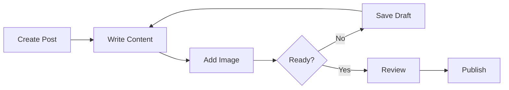

# Sauti 116 Helpline CMS - User Manual


**Version:** 1.0  
**Last Updated:** December 10, 2025  
**Organization:** Ministry of Gender, Labour & Social Development, Uganda  
**Website:** https://sauti.mglsd.go.ug

---

## 📋 Table of Contents

- [About This Manual](#about-this-manual)
- [Quick Start Guide](#quick-start-guide)
- [1. Introduction](#1-introduction)
- [2. Getting Started](#2-getting-started)
- [3. Admin Dashboard](#3-admin-dashboard)
- [4. Managing Blog Posts](#4-managing-blog-posts)
- [5. Managing Videos](#5-managing-videos)
- [6. Managing Resources](#6-managing-resources)
- [7. Managing Partners](#7-managing-partners)
- [8. Uploads & Media](#8-uploads--media)
- [9. Public Website](#9-public-website)
- [10. Best Practices](#10-best-practices)
- [11. Troubleshooting](#11-troubleshooting)
- [12. Support & Contact](#12-support--contact)

---

## About This Manual

This comprehensive user manual provides detailed instructions for administrators and content managers of the Sauti 116 Helpline Content Management System (CMS).

### 👥 Target Audience
- System Administrators
- Content Managers
- Editorial Staff
- Media Coordinators
- Communications Officers

### 📚 What's Covered
- Complete system navigation and functionality
- Step-by-step content creation procedures
- Best practices for maintaining quality
- Troubleshooting common issues
- Public website overview

---

## Quick Start Guide

### 🚀 For New Users

1. **Access the System**
   - Navigate to: `https://sauti.mglsd.go.ug/cms-admin/dashboard`
   - Enter your credentials
   - Click "Sign in"

2. **Create Your First Blog Post**
   - Click the blue "New Blog Post" button
   - Enter title and content
   - Add featured image
   - Set status to "Published"
   - Click "Update Post"

3. **Add a Video**
   - Click the orange "New Video" button
   - Enter video details
   - Paste YouTube URL or upload video
   - Set status to "Published"
   - Click "Publish"

4. **Upload a Resource**
   - Go to Resources section
   - Click "+ Add New Resource"
   - Fill in details
   - Upload file (PDF, DOC, Image, etc.)
   - Click "Create Resource"

### ⚡ Quick Actions

| Action | Button Location | Shortcut |
|--------|----------------|----------|
| New Blog Post | Dashboard center (blue) | Ctrl+B |
| New Video | Dashboard center (orange) | Ctrl+V |
| New Resource | Resources page | - |
| Preview Content | Top right (eye icon) | - |
| Save Draft | Top right (orange) | Ctrl+S |
| Publish | Top right (blue) | - |

---

## 1. Introduction

### 1.1 About Sauti 116 Helpline

Sauti 116 is Uganda's national child helpline, providing **free, confidential, and accessible support 24/7** across all telecommunications networks. 

#### 🎯 Who We Serve
- Children and adolescents
- Gender-Based Violence (GBV) survivors
- Migrant workers
- Communities seeking child protection support

#### 🌍 Service Coverage
- **Languages:** English, Luganda, Swahili
- **Availability:** 24 hours, 7 days a week
- **Cost:** Toll-free from all networks
- **Confidentiality:** All calls are confidential

#### 🤝 Key Partners
- Ministry of Gender, Labour & Social Development (MGLSD)
- UNICEF
- ITU 116 Standard compliant

### 1.2 System Overview

The Sauti CMS consists of two main components:

#### 🔐 Admin Panel (Backend)
- **URL:** `sauti.mglsd.go.ug/cms-admin/dashboard`
- **Access:** Password-protected
- **Features:** Content creation, editing, publishing, analytics

#### 🌐 Public Website (Frontend)
- **URL:** `sauti.mglsd.go.ug/cms/`
- **Access:** Public
- **Content:** Published blogs, videos, resources, contact information

---

## 2. Getting Started

### 2.1 System Requirements

#### 💻 Hardware
- Computer with minimum 4GB RAM
- Stable internet connection (2 Mbps or higher)
- Display resolution: 1366x768 or higher

#### 🌐 Software
**Supported Browsers:**
- ✅ Google Chrome (v90+) - **Recommended**
- ✅ Mozilla Firefox (v88+)
- ✅ Microsoft Edge (v90+)
- ✅ Safari (v14+)

**Requirements:**
- JavaScript enabled
- Cookies enabled
- Pop-ups allowed for the domain

### 2.2 Accessing the Admin Panel


*Screenshot 1: Admin login page with Sauti branding*

#### Step-by-Step Login

1. **Navigate to Login Page**
   ```
   https://sauti.mglsd.go.ug/cms-admin/dashboard
   ```

2. **Enter Credentials**
   - **Username:** Your assigned admin username
   - **Password:** Your secure password
   - ⚠️ Ensure Caps Lock is OFF

3. **Click Sign In**
   - Blue button with lock icon
   - Wait 1-3 seconds for authentication

4. **Dashboard Loads**
   - Welcome message appears
   - Content statistics displayed

#### 🔒 Security Best Practices

- ✅ Never share login credentials
- ✅ Use strong passwords (min 12 characters)
- ✅ Change password every 90 days
- ✅ Log out when leaving workstation
- ✅ Report suspicious activity immediately

#### ⚠️ Troubleshooting Login Issues

| Issue | Solution |
|-------|----------|
| "Invalid username or password" | Verify credentials, check Caps Lock |
| Page won't load | Check internet, clear cache, try different browser |
| Forgot password | Contact admin: info@sauti.mglsd.go.ug |
| Account locked | Contact admin (locks after 5 failed attempts) |

### 2.3 Understanding the Dashboard


*Screenshot 2: Content Management Dashboard overview*

#### Dashboard Components

**A. Header Section**
- 🏢 **Logo & Site Name:** "Sauti Admin - 116 helpline CMS"
- 🎉 **Welcome Message:** Green notification "Welcome back!"
- ➕ **Quick Add Button:** Blue plus icon for fast content creation
- 👤 **User Profile:** Your avatar and account menu

**B. Statistics Cards**

The dashboard displays four key metrics:

| Metric | Icon | Description |
|--------|------|-------------|
| **Total Reports** | 📄 | All submitted helpline cases |
| **Pending Review** | ⏰ | Cases requiring attention |
| **Resolved** | ✅ | Successfully closed cases |
| **Resources** | 📁 | Downloadable content available |

**C. Quick Action Buttons**

- 🔵 **New Blog Post** - Create blog content
- 🟠 **New Video** - Add video content
- ⚪ **New Resource** - Upload downloadable files
- ⚪ **New FAQ** - Add frequently asked questions

**D. Content Filters**

- **Content Type:** Filter by blog, video, resource, etc.
- **Status:** Filter by published, draft, pending
- **Search Bar:** Find specific content quickly

---

## 3. Admin Dashboard

### 3.1 Navigation Structure

The left sidebar contains the main navigation menu:

#### 🎨 Quick Actions (Top)

```
┌─────────────────────────────┐
│ ➕ New Blog Post   (Blue)   │
│ 📹 New Video       (Orange) │
└─────────────────────────────┘
```

#### 📊 Content Management

- 📈 **Dashboard** - Overview and statistics
- 🛡️ **Reports** - Submitted case reports
- 📝 **Blogs** `[2]` - Blog post management
- ✏️ **Drafts** `[2]` - Unpublished content
- 🎬 **Videos** - Video content library
- 📁 **Resources** - Downloadable materials

#### 🗂️ Content Organization

- 🤝 **Partners** - Partner organizations
- 📄 **Blogs** - Alternative blog access
- ☁️ **Uploads** - Media library
- 📱 **Social Media** - Social integrations

#### ⚙️ System & Settings

- 👥 **Team Members** - User management
- 🚪 **Logout** - Sign out securely

### 3.2 User Interface Elements

#### Button Types

| Type | Color | Usage | Example |
|------|-------|-------|---------|
| **Primary** | Blue | Main actions | "Publish", "Save", "Create" |
| **Secondary** | Orange | Alt actions | "Save Draft", "Preview" |
| **Tertiary** | White/Outlined | Less critical | "Cancel" |
| **Danger** | Red | Destructive | "Delete" |

#### Status Badges

| Status | Color | Meaning |
|--------|-------|---------|
| **Published** | 🟢 Green | Live on website |
| **Draft** | 🟡 Yellow | Not visible to public |
| **Pending** | 🟠 Orange | Awaiting approval |

#### Action Icons

| Icon | Action | Function |
|------|--------|----------|
| 👁️ | View | Preview content |
| ✏️ | Edit | Modify content |
| 📋 | Copy | Duplicate content |
| 🗑️ | Delete | Remove permanently |

---

## 4. Managing Blog Posts

### 4.1 Understanding Blog Posts

Blog posts are articles published on the public website to:
- 📚 **Educate** about child rights and safety
- 📢 **Raise awareness** about GBV and helpline services
- 🤝 **Engage** communities
- 📈 **Improve SEO** and website visibility

#### Blog Post Lifecycle

```
Creation → Draft → Review → Publish → Live → Archive
```

### 4.2 Creating a New Blog Post


*Screenshot 3: Blog post editor interface*

#### Method 1: From Dashboard
1. Click blue **"New Blog Post"** button
2. Editor opens immediately

#### Method 2: From Blogs List
1. Click **"Blogs"** in sidebar
2. Click **"+ Add New Blog"** button

#### Method 3: Quick Add
1. Click blue **+** icon (top right)
2. Select "Blog Post"

### 4.3 Blog Post Editor

#### Page Layout

```
┌──────────────┬─────────────────────┬──────────────┐
│              │                     │              │
│   Sidebar    │   Content Editor    │   Settings   │
│              │                     │              │
│  Navigation  │   Title             │   Author     │
│              │   Content           │   Date       │
│              │   Word Count        │   Categories │
│              │                     │   Tags       │
│              │                     │   Status     │
│              │                     │   Image      │
└──────────────┴─────────────────────┴──────────────┘
```

#### Top Action Buttons

| Button | Color | Function |
|--------|-------|----------|
| 👁️ **Preview** | White | See how post looks |
| 💾 **Save Draft** | Orange | Save without publishing |
| 📤 **Update Post** | Blue | Save and publish |

### 4.4 Writing Content

#### A. Post Title Field

```markdown
Post Title *
┌─────────────────────────────────────────┐
│ school issue                            │
└─────────────────────────────────────────┘
12/100 characters • Good length
```

**Title Best Practices:**

✅ **DO:**
- Keep between 40-60 characters
- Include relevant keywords
- Be clear and descriptive
- Use title case

❌ **DON'T:**
- Use ALL CAPS
- Add excessive punctuation!!!
- Use clickbait
- Exceed 100 characters

**Good Examples:**
- "Understanding Child Rights in Uganda"
- "How to Report Abuse Safely: A Guide"
- "5 Signs Your Child Needs Support"

**Poor Examples:**
- "CLICK HERE NOW!!!" (clickbait)
- "Post 123" (not descriptive)
- "thisisaverylongtitle..." (too long, no spaces)

#### B. Main Content Field

```markdown
Main Content *
┌─────────────────────────────────────────┐
│                                         │
│ Write your blog post content with      │
│ rich formatting                         │
│                                         │
│ [Your content here]                     │
│                                         │
└─────────────────────────────────────────┘
20 words • 1 min read
```

**Content Guidelines:**

| Content Type | Recommended Length | Reading Time |
|--------------|-------------------|--------------|
| News Update | 150-300 words | 1-2 minutes |
| Educational Article | 500-800 words | 3-5 minutes |
| Success Story | 300-500 words | 2-3 minutes |
| In-depth Guide | 1000-1500 words | 6-10 minutes |

**Writing Tips:**

1. **Structure**
   - Engaging opening paragraph
   - Short paragraphs (2-4 sentences)
   - Clear subheadings
   - Call-to-action at end

2. **Tone**
   - Professional yet compassionate
   - Culturally sensitive
   - Empowering language
   - Age-appropriate

3. **Content**
   - Factually accurate
   - Cite sources when needed
   - Include 116 helpline information
   - Actionable advice

**Example Content:**
```markdown
School fees remain a significant challenge for many families in Uganda. 
When parents struggle to pay school fees, children may face exclusion 
from classes or even expulsion.

If you're facing difficulties with school fees, Sauti 116 can help. 
Our counselors can:
- Provide guidance on available education support programs
- Connect you with organizations offering financial assistance
- Advocate for your child's right to education

Call 116 toll-free from any network, 24/7. The call is confidential 
and available in English, Luganda, and Swahili.
```

### 4.5 Post Settings Panel


*Screenshot 4: Post settings with scheduling and featured image*

#### A. Author
```
Author
┌──────────────────────┐
│ 👤 admin            │
└──────────────────────┘
```
- Assigns post authorship
- Tracks content creator
- Displays on published post

#### B. Publication Date
```
Publication Date
┌──────────────────────┐
│ 📅 12/10/2025       │
└──────────────────────┘
```
- Sets official publication date
- Determines post order
- Click to open calendar picker

#### C. Categories
```
Categories
☑️ blog test
☐ Child Rights
☐ Success Stories
☐ Service Updates
```
- Organize posts by topic
- Multiple categories allowed
- Improves navigation and SEO

**Common Categories:**
- Child Rights
- Success Stories
- Service Updates
- Community Outreach
- Educational Resources
- GBV Awareness
- Helpline Information

#### D. Tags
```
Tags
┌─────────────────────────────────────────┐
│ helpline, children, safety, uganda     │
└─────────────────────────────────────────┘
Separate tags with commas for better organization
```

**Tag Best Practices:**

✅ Use 5-8 tags per post  
✅ Specific keywords: "school fees", "education"  
✅ Target audience: "parents", "children"  
✅ Locations: "Kampala", "Uganda"  
✅ Issues: "child protection", "reporting"

❌ Single letters  
❌ Generic terms: "help", "good"  
❌ More than 10 tags

#### E. Status

```
Status
┌──────────────────────┐
│ ✅ Published        │
│   Draft             │
└──────────────────────┘
Published posts are visible on the frontend
```

**Status Options:**

| Status | Visibility | Use When |
|--------|-----------|----------|
| **Published** | ✅ Public | Content is final and reviewed |
| **Draft** | 🔒 Admin only | Still editing or awaiting approval |

**Decision Matrix:**

| Condition | Status | Reason |
|-----------|--------|--------|
| Content incomplete | Draft | Needs more work |
| Contains errors | Draft | Requires correction |
| Awaiting approval | Draft | Needs review |
| Missing images | Draft | Incomplete |
| Fully reviewed | Published | Ready for public |
| Time-sensitive | Published | Immediate need |

#### F. Schedule Publishing

```
🕐 Schedule Publishing
┌─────────────────────────────────────────┐
│ mm/dd/yyyy, --:-- --                   │
└─────────────────────────────────────────┘
Set a date and time to automatically publish this post.
It will stay as draft until then.
```

**How It Works:**
1. Set future date and time
2. Post stays as "Draft"
3. System auto-publishes at scheduled time
4. No manual intervention needed

**Best Publishing Times:**

| Time | Engagement | Best For |
|------|-----------|----------|
| 8-10 AM | High | Professional content |
| 12-2 PM | Moderate | General updates |
| 6-8 PM | High | Evening readers |
| 10 PM-6 AM | Low | Avoid |

**Scheduling Strategy:**
```
Monday     → Service updates
Wednesday  → Educational articles
Friday     → Success stories
```

#### G. Featured Image

```
🖼️ Featured Image
┌─────────────────────────────────────────┐
│                                         │
│         [Image Preview]                 │
│                                         │
│            ❌ Remove                     │
└─────────────────────────────────────────┘
[Change Image]
```

**Image Requirements:**
- **Size:** 1200 x 630 pixels (optimal)
- **Format:** JPG or PNG
- **File Size:** Under 200KB
- **Quality:** High resolution, not pixelated

**Where Featured Images Appear:**
- ✅ Top of blog post
- ✅ Blog listing thumbnails
- ✅ Social media shares
- ✅ Related posts sections

**Image Selection Tips:**

| Post Type | Suggested Image |
|-----------|----------------|
| News/Announcement | Event or activity photo |
| Educational | Infographic or diagram |
| Success Story | Community photo (with consent) |
| Service Update | Logo or service imagery |

**Steps to Add:**
1. Click "Choose File" or drag image
2. Select image from computer
3. Wait for upload (2-10 seconds)
4. Preview appears
5. Verify image looks correct

**To Change:**
1. Click "Change Image" button
2. Upload new image
3. Old image replaced

**To Remove:**
1. Click red ❌ in corner
2. Image disappears
3. Can re-add anytime

### 4.6 Publishing Workflow



#### Pre-Publish Checklist

- [ ] Title clear and compelling (40-60 chars)
- [ ] Content complete (no [TODO] markers)
- [ ] No spelling or grammar errors
- [ ] Featured image added (1200x630px)
- [ ] Categories selected
- [ ] 5-8 tags added
- [ ] Author assigned
- [ ] Date set correctly
- [ ] Preview checked
- [ ] Call-to-action included (116 helpline)
- [ ] Facts verified
- [ ] Links working
- [ ] Mobile-friendly formatting

### 4.7 Managing Existing Posts


*Screenshot 7: Blog posts management overview*

#### Accessing Blog List

**Method 1:** Click "Blogs" in sidebar (shows badge `[2]`)  
**Method 2:** Click "Dashboard" → "View All Posts"

#### List View Columns

| Column | Shows | Purpose |
|--------|-------|---------|
| **POST** | Thumbnail + title + excerpt | Visual identification |
| **AUTHOR** | Content creator | Attribution |
| **CATEGORY** | Classification | Organization |
| **STATUS** | Published/Draft | Publication state |
| **VIEWS** | View count | Popularity tracking |
| **DATE** | Publication date | Chronological order |
| **ACTIONS** | 👁️ ✏️ 📋 🗑️ | Quick actions |

#### Filter Bar

```
┌────────────────┬─────────────┬─────────────┬─────────────┐
│ Search posts...│ All Status  │All Categories│All Authors  │
└────────────────┴─────────────┴─────────────┴─────────────┘
```

**Search Functionality:**
- Searches: Title, content, author, tags
- Real-time filtering
- Case-insensitive

#### Action Buttons

**👁️ View (Eye Icon)**
- Opens post preview
- Shows how visitors see it
- Available for all posts

**✏️ Edit (Pencil Icon)**
- Opens post editor
- Loads existing content
- Save updates with "Update Post"

**📋 Copy (Document Icon)**
- Creates duplicate as draft
- Title appended with "- Copy"
- Edit before publishing

**🗑️ Delete (Trash Icon)**
- ⚠️ Permanent deletion
- Confirmation required
- Cannot be undone

#### Bulk Operations

If available in your system:
1. Select checkboxes for multiple posts
2. Choose bulk action (publish, delete, categorize)
3. Click "Apply"
4. Confirm action

### 4.8 Editing Published Posts

**When to Edit:**
- Correct typos or errors
- Update outdated information
- Add new details
- Improve SEO
- Respond to feedback

**Steps:**
1. Locate post in Blogs list
2. Click ✏️ Edit icon
3. Make changes
4. Click "Preview" to review
5. Click "Update Post" to save

**What Happens:**
- Changes appear immediately on website
- Search engines re-crawl content
- Updated date may show
- Visitors see new version instantly

**Best Practice:**
Add note at top of post:
```
[Updated: December 10, 2025] - Information updated to reflect new helpline hours
```

### 4.9 Content Quality Standards

#### Before Publishing

**Content Quality:**
- ✅ No spelling/grammar errors
- ✅ Facts verified and accurate
- ✅ Appropriate tone
- ✅ Culturally sensitive
- ✅ All links functional
- ✅ 116 helpline mentioned

**SEO Optimization:**
- ✅ Keywords in title
- ✅ Keywords in content (natural)
- ✅ Headings structured (H1, H2, H3)
- ✅ Meta description written
- ✅ Images have alt text
- ✅ Internal links included

**Visual Elements:**
- ✅ Featured image added
- ✅ Images relevant and high-quality
- ✅ Proper image sizing
- ✅ Alt text descriptive
- ✅ Consistent visual style

**User Experience:**
- ✅ Short paragraphs
- ✅ Clear structure with subheadings
- ✅ Engaging introduction
- ✅ Clear call-to-action
- ✅ Mobile-friendly

**Legal & Ethical:**
- ✅ No copyrighted material without permission
- ✅ No identifiable photos without consent
- ✅ Privacy respected
- ✅ No harmful content
- ✅ Age-appropriate

---

## 5. Managing Videos

### 5.1 Understanding Video Content

Videos are powerful tools for:
- 📚 **Education** - Teaching about rights and safety
- 🎥 **Demonstrations** - Showing how to use services
- 💬 **Testimonials** - Sharing success stories (with consent)
- 📢 **Awareness** - Promoting helpline visibility
- 🌍 **Multilingual Outreach** - Content in local languages

### 5.2 Creating a New Video


*Screenshot 5: Video creation interface*

#### Access Methods

**Method 1:** Click orange "New Video" button (dashboard)  
**Method 2:** Videos section → "+ Add New Video"  
**Method 3:** Quick add (+) → Select "Video"

### 5.3 Video Editor Layout

```
┌──────────────────────────────────────────────────────┐
│  Edit Video                 👁️ Preview  📤 Publish  │
├─────────────────────────────┬────────────────────────┤
│                             │                        │
│  Video Title                │  METADATA              │
│  ┌──────────────────────┐  │                        │
│  │ uganda               │  │  Category              │
│  └──────────────────────┘  │  ┌──────────────────┐ │
│                             │  │ video category   │ │
│  Description                │  └──────────────────┘ │
│  ┌──────────────────────┐  │                        │
│  │ uganda as a country  │  │  Language              │
│  │                      │  │  ┌──────────────────┐ │
│  └──────────────────────┘  │  │ Luganda          │ │
│                             │  └──────────────────┘ │
│  VIDEO & THUMBNAIL          │                        │
│  ○ YouTube URL              │  ☑️ Feature on homepage│
│  ○ Upload Video File        │                        │
│                             │  PUBLISHING            │
│  YouTube URL                │                        │
│  ┌──────────────────────┐  │  Status                │
│  │ https://youtube.com/ │  │  ✅ Published         │
│  └──────────────────────┘  │                        │
│                             │  🕐 Schedule Publishing│
│  Thumbnail                  │  ┌──────────────────┐ │
│  [Upload]                   │  │ mm/dd/yyyy --:--  │ │
│                             │  └──────────────────┘ │
└─────────────────────────────┴────────────────────────┘
```

### 5.4 Video Details

#### A. Video Title
```
Video Title
┌─────────────────────────────────────────┐
│ uganda                                  │
└─────────────────────────────────────────┘
```

**Best Practices:**
- Clear and descriptive (40-70 characters)
- Keywords at beginning
- Include language if multilingual
- Example: "How to Report Abuse - English"
- Example: "Jinsi ya Kuripoti - Swahili"

#### B. Description
```
Description
┌─────────────────────────────────────────┐
│ uganda as a country                     │
│                                         │
└─────────────────────────────────────────┘
```

**What to Include:**
1. Brief overview of video content
2. Key topics covered
3. Target audience
4. Duration (e.g., "5-minute video")
5. Language(s) spoken
6. Call to action ("Call 116 for help")

**Example:**
```
This 8-minute video explains how to report child abuse safely 
and confidentially in Uganda. Learn about the Sauti 116 helpline, 
your rights, and the reporting process.

Available in Luganda with English subtitles.

For immediate help, call 116 toll-free, 24/7 from any network.
```

### 5.5 Video Source Options

#### Option 1: YouTube URL (Recommended)

**Radio Button:** ⚪ YouTube URL

**Steps:**
1. Select "YouTube URL" option
2. Get video URL from YouTube:
   - Click "Share" button on video
   - Copy URL
3. Paste URL in field

**Valid URL Formats:**
```
✅ https://www.youtube.com/watch?v=VIDEO_ID
✅ https://youtu.be/VIDEO_ID
✅ https://www.youtube.com/embed/VIDEO_ID

❌ youtube.com/watch (missing https://)
❌ https://vimeo.com/12345 (wrong platform)
```

**Why Use YouTube:**
- ✅ Unlimited bandwidth
- ✅ Global CDN
- ✅ Reliable hosting
- ✅ Built-in analytics
- ✅ No storage limits

#### Option 2: Upload Video File

**Radio Button:** ⚪ Upload Video File

**Supported Formats:**
- MP4 (recommended)
- AVI
- MOV
- WebM

**File Requirements:**
- **Max Size:** 500MB (depends on server)
- **Length:** 15 minutes or less recommended
- **Quality:** 720p or 1080p
- **Format:** MP4 with H.264 codec

**Steps:**
1. Select "Upload Video File"
2. Click "Choose File"
3. Select video from computer
4. Wait for upload (may take several minutes)

**Upload Time Estimates:**
- 50MB video: 1-2 minutes
- 100MB video: 2-5 minutes
- 500MB video: 10-20 minutes

⚠️ **Important:** Don't close browser during upload!

### 5.6 Video Metadata

#### Category
```
Category
┌─────────────────────────────────────────┐
│ video category                         │
└─────────────────────────────────────────┘
```

**Common Categories:**
- Educational
- Testimonials
- Service Announcements
- Community Outreach
- Training
- Public Service Announcements (PSAs)
- Event Coverage

#### Language
```
Language
┌─────────────────────────────────────────┐
│ Luganda                                 │
└─────────────────────────────────────────┘
```

**Options:** English, Luganda, Swahili

**Purpose:**
- Helps viewers find content in their language
- Supports multilingual service delivery
- Enables language filtering

#### Feature on Homepage
```
☑️ Feature on homepage
```

**When to Feature:**
- ✅ Important announcements
- ✅ High-quality, engaging content
- ✅ Newest service videos
- ✅ Seasonal or time-sensitive content

**When NOT to Feature:**
- ❌ Routine updates
- ❌ Archived content
- ❌ Specialized content
- ❌ Low relevance to general audience

**Note:** Feature only 1-3 videos at a time

### 5.7 Publishing Settings

#### Status
```
Status
┌─────────────────────────────────────────┐
│ ✅ Published                            │
└─────────────────────────────────────────┘
Published videos are visible on the frontend
```

**Options:**
- **Published:** Live on website immediately
- **Draft:** Saved but not public

#### Schedule Publishing
```
🕐 Schedule Publishing
┌─────────────────────────────────────────┐
│ mm/dd/yyyy, --:-- --                   │
└─────────────────────────────────────────┘
Set a date and time to automatically publish this video.
It will stay as draft until then.
```

Same functionality as blog scheduling.

### 5.8 Video Thumbnails

**Thumbnail Section:**
- Located next to/below video source
- Click to upload image

**Requirements:**
- **Size:** 1280 x 720 pixels (16:9 ratio)
- **Format:** JPG or PNG
- **Content:** Representative frame
- **Quality:** Clear, not blurry

**Creating Thumbnails:**

**Method A:** Use YouTube auto-generated
1. Download from YouTube
2. Upload to CMS

**Method B:** Custom screenshot
1. Play video to key frame
2. Take screenshot
3. Crop to 1280x720
4. Upload

**Method C:** Custom design
1. Use Canva/Photoshop
2. Create 1280x720 design
3. Export as JPG
4. Upload

### 5.9 Managing Videos


*Screenshot 6: Videos management page*

#### Statistics Dashboard
```
┌──────────────┬──────────────┬──────────────┬──────────────┐
│ Total Videos │  Published   │    Drafts    │ Total Views  │
│      3       │      0       │      0       │      0       │
└──────────────┴──────────────┴──────────────┴──────────────┘
```

#### Video List Table

| VIDEO | CATEGORY | STATUS | VIEWS | DURATION | DATE | ACTIONS |
|-------|----------|--------|-------|----------|------|---------|
| [thumbnail] uganda<br>uganda as a country | video category | PUBLISHED | 0 | N/A | 12/10/2025 | 👁️ ✏️ 🗑️ |
| [thumbnail] school<br>this is a video about... | video category | PUBLISHED | 0 | N/A | 12/3/2025 | 👁️ ✏️ 🗑️ |
| [thumbnail] phyl<br>testphyl | video category | PUBLISHED | 0 | N/A | 10/31/2025 | 👁️ ✏️ 🗑️ |

#### Filter Options
```
┌──────────────┬──────────────┬──────────────────┐
│ Search...    │  All Status  │  All Categories  │
└──────────────┴──────────────┴──────────────────┘
```

#### Actions

**👁️ View:** Preview video  
**✏️ Edit:** Modify details  
**🗑️ Delete:** Remove permanently

### 5.10 Video Analytics

**Basic Metrics (in CMS):**
- View counts
- Publication dates
- Status tracking

**Advanced Metrics (YouTube Analytics):**
- Watch time
- Audience retention
- Traffic sources
- Demographics
- Engagement (likes, comments)

**Using Data:**
1. Identify top-performing topics
2. Note optimal video length
3. Best publishing times
4. Understand audience demographics
5. Create more of what works

---

## 6. Managing Resources

### 6.1 Understanding Resources

Resources are downloadable files provided to visitors:
- 📚 Educational materials
- 📄 Service information
- 📝 Training materials
- 📊 Reports and publications
- 📋 Forms and templates
- 🎵 Audio/video files

### 6.2 Creating Resources


*Screenshot 8: Resources management overview*


*Screenshot 9: Resource creation dialog*

#### Access Method
1. Click "Resources" in sidebar
2. Click "+ Add New Resource" (blue button, top right)
3. Modal dialog opens

### 6.3 Resource Form

```
┌─────────────────────────────────────────────────┐
│  Add New Resource                               │
├─────────────────────────────────────────────────┤
│  Resource Title                                 │
│  ┌───────────────────────────────────────────┐ │
│  │ covid 19 prevention                       │ │
│  └───────────────────────────────────────────┘ │
│                                                 │
│  Description                                    │
│  ┌───────────────────────────────────────────┐ │
│  │ this is guide on prevention of covid 19  │ │
│  └───────────────────────────────────────────┘ │
│                                                 │
│  Category                                       │
│  ┌───────────────────────────────────────────┐ │
│  │ resource category                         │ │
│  └───────────────────────────────────────────┘ │
│                                                 │
│  Language                                       │
│  ┌───────────────────────────────────────────┐ │
│  │ Swahili                                   │ │
│  └───────────────────────────────────────────┘ │
│                                                 │
│  File Upload                                    │
│  [Choose File]  Pasted image.png               │
│                                                 │
│  Supported: PDF, DOC/DOCX, Images (JPG/PNG),   │
│  Video (MP4/AVI/MOV), Audio (MP3/M4A/WAV/OGG)  │
│                                                 │
│         [Cancel]  [Create Resource]             │
└─────────────────────────────────────────────────┘
```

### 6.4 Supported File Types

#### Documents
| Format | Extension | Max Size | Use Case |
|--------|-----------|----------|----------|
| PDF | .pdf | 10MB | Guides, reports, forms |
| Word | .doc, .docx | 10MB | Editable templates |

#### Images
| Format | Extension | Max Size | Use Case |
|--------|-----------|----------|----------|
| JPEG | .jpg, .jpeg | 5MB | Photos, posters |
| PNG | .png | 5MB | Infographics, diagrams |

#### Video
| Format | Extension | Max Size | Use Case |
|--------|-----------|----------|----------|
| MP4 | .mp4 | 100MB | Training videos |
| AVI | .avi | 100MB | High-quality video |
| MOV | .mov | 100MB | Apple format |

#### Audio
| Format | Extension | Max Size | Use Case |
|--------|-----------|----------|----------|
| MP3 | .mp3 | 50MB | Podcasts, PSAs |
| M4A | .m4a | 50MB | Higher quality audio |
| WAV | .wav | 50MB | Uncompressed audio |
| OGG | .ogg | 50MB | Open-source format |

### 6.5 Resource Categories

**Recommended Categories:**
- Child Protection
- Health & Safety
- Education
- Legal Information
- Service Information
- Training Materials
- Reports & Publications
- Forms & Templates

### 6.6 Multi-language Support

**Supported Languages:**
- English
- Luganda
- Swahili

**Strategy 1: Separate Resources**
```
✅ "Child Safety Guide - English"
✅ "Mwongozo wa Usalama wa Watoto - Swahili"
✅ "Ebyobukuumi by'Abaana - Luganda"
```

**Strategy 2: Bilingual Documents**
```
✅ "Child Safety Guide (English/Swahili)"
```

### 6.7 Managing Resources

#### Resources List View

| FILE TYPE | TITLE | DESCRIPTION | CATEGORY | LANGUAGE | ID | DATE | DOWNLOADS | ACTIONS |
|-----------|-------|-------------|----------|----------|----|----|-----------|---------|
| 📄 DOCX | Gender Based Violence Topics | these are the tips | Uncategorized | English | 11959 | Recently | 0 | 👁️ ⬇️ |
| 🖼️ PNG | scholl | school | Uncategorized | English | 2494310 | Recently | 0 | 👁️ ⬇️ |
| 🖼️ JPEG | test 25 | u t t t tet t ttt tt tttt | Uncategorized | English | 124213 | Recently | 0 | 👁️ ⬇️ |

#### Filter Options
```
┌──────────────┬──────────────┬──────────┬──────────────┐
│ Search...    │All Categories│All Status│All Languages │
└──────────────┴──────────────┴──────────┴──────────────┘
```

#### Actions

**👁️ View:** Preview resource  
**⬇️ Download:** Download file  
**✏️ Edit:** Modify details  
**🗑️ Delete:** Remove permanently

### 6.8 Download Tracking

**Metrics Tracked:**
- Total Downloads (all time)
- This Month (current month)
- Per-resource downloads

**Why Track:**
- 📊 Measure engagement
- 📈 Identify popular content
- 💡 Inform content strategy
- 📝 Report on reach

**Using Data:**

**High Downloads:**
- Create similar content
- Translate to other languages
- Promote more widely

**Low Downloads:**
- Improve title/description
- Better categorization
- Promote on social media
- Convert to different format

---

## 7. Managing Partners

### 7.1 Understanding Partners

Partners are organizations collaborating with Sauti 116:
- 🏛️ Government agencies
- 🌍 International organizations
- 🤝 Local NGOs
- 💼 Private sector
- 🎓 Academic institutions

### 7.2 Adding Partners


*Screenshot 10: Partner creation dialog*

### 7.3 Partner Form

```
┌─────────────────────────────────────────────────┐
│  Add New Partner                                │
├─────────────────────────────────────────────────┤
│  Partner Name                                   │
│  ┌───────────────────────────────────────────┐ │
│  │ GOVERNMENT                                │ │
│  └───────────────────────────────────────────┘ │
│                                                 │
│  Description                                    │
│  ┌───────────────────────────────────────────┐ │
│  │ this is our new partner                   │ │
│  └───────────────────────────────────────────┘ │
│                                                 │
│  Type                                           │
│  ┌───────────────────────────────────────────┐ │
│  │ Government Agency                         │ │
│  └───────────────────────────────────────────┘ │
│                                                 │
│  Website                                        │
│  ┌───────────────────────────────────────────┐ │
│  │                                           │ │
│  └───────────────────────────────────────────┘ │
│                                                 │
│  Email                                          │
│  ┌───────────────────────────────────────────┐ │
│  │                                           │ │
│  └───────────────────────────────────────────┘ │
│                                                 │
│  Phone                                          │
│  ┌───────────────────────────────────────────┐ │
│  │                                           │ │
│  └───────────────────────────────────────────┘ │
│                                                 │
│         [Cancel]  [Create Partner]              │
└─────────────────────────────────────────────────┘
```

### 7.4 Partner Types

| Type | Examples | Purpose |
|------|----------|---------|
| **Government Agency** | MGLSD, Uganda Police | Policy, mandate, reach |
| **International Org** | UNICEF, WHO | Technical support, funding |
| **Local NGO** | Child protection orgs | Ground implementation |
| **Private Sector** | MTN, Airtel | Infrastructure, CSR |
| **Academic** | Universities | Research, training |

### 7.5 Partner Information

**What to Include in Description:**
- Nature of partnership
- Services provided
- Geographic coverage
- Partnership duration
- Key achievements

**Example:**
```
The Ministry of Gender, Labour & Social Development (MGLSD) 
is the primary government partner for Sauti 116. MGLSD provides 
policy direction, coordinates national child protection efforts, 
and ensures integration of helpline services into national systems.

Partnership since: 2018
Areas of collaboration: Policy development, funding, capacity 
building, monitoring and evaluation
```

---

## 8. Uploads & Media

### 8.1 Media Library Overview

The Uploads section manages:
- 🖼️ Hero images (homepage banners)
- 📷 Featured images (blog thumbnails)
- 🎬 Video thumbnails
- 📄 Resource files
- 🏢 Partner logos
- 🎨 Icons and UI elements

### 8.2 Creating Uploads


*Screenshot 11: Uploads management interface*

### 8.3 Upload Form

```
┌─────────────────────────────────────────────────┐
│  Label                                          │
│  ┌───────────────────────────────────────────┐ │
│  │ hero image                                │ │
│  └───────────────────────────────────────────┘ │
│                                                 │
│  Key/Identifier                                 │
│  ┌───────────────────────────────────────────┐ │
│  │ hero_image                                │ │
│  └───────────────────────────────────────────┘ │
│                                                 │
│  Page                                           │
│  ┌───────────────────────────────────────────┐ │
│  │ Home                                      │ │
│  └───────────────────────────────────────────┘ │
│                                                 │
│  Content Type                                   │
│  ┌───────────────────────────────────────────┐ │
│  │ Photos/Images                             │ │
│  └───────────────────────────────────────────┘ │
│                                                 │
│  Upload Image                                   │
│  [Choose File]  Pasted image.png               │
│                                                 │
│  Description                                    │
│  ┌───────────────────────────────────────────┐ │
│  │ this is the hero page                     │ │
│  └───────────────────────────────────────────┘ │
│                                                 │
│         [Cancel]  [Create Content]              │
└─────────────────────────────────────────────────┘
```

### 8.4 Hero Image Specifications

**Requirements:**
- **Dimensions:** 1920 x 1080 pixels (Full HD)
- **Format:** JPG (preferred) or PNG
- **File Size:** Under 500KB
- **Composition:**
  - Important content centered
  - Text overlay area clear
  - High contrast for readability

### 8.5 Image Optimization

**Compression Tools:**
- TinyPNG
- ImageOptim
- Squoosh.app

**Target Sizes:**
- Hero images: Under 500KB
- Thumbnails: Under 200KB
- Icons: Under 50KB

**Responsive Sizes:**
- Mobile: 800px wide
- Tablet: 1200px wide
- Desktop: 1920px wide

### 8.6 File Organization

**Naming Convention:**
```
lowercase-with-hyphens-descriptive-name.jpg

Examples:
✅ homepage-hero-children-smiling.jpg
✅ blog-featured-school-fees-1200x630.jpg
✅ partner-logo-unicef.svg

❌ IMG_1234.jpg
❌ image final FINAL.png
```

---

## 9. Public Website

### 9.1 Homepage


*Screenshot 12: Public-facing homepage*

#### Header Navigation
```
┌─────────────────────────────────────────────────────────────┐
│ [Sauti Logo] 116 helpline                                   │
│                                                               │
│ Home  About  Services  Blogs  Videos  Resources  FAQs        │
│ Contact                               [📞 Call 116]          │
└─────────────────────────────────────────────────────────────┘
```

#### Hero Section
```
┌─────────────────────────────────────────────────────────────┐
│                                                               │
│            Every child deserves a safe voice.                │
│                                                               │
│    Sauti 116 is free, confidential and available 24/7       │
│    across all telecoms. Report abuse, seek guidance, or      │
│    get urgent help in your language.                         │
│                                                               │
│     [📞 Call 116 Now]  [📄 Report a Case]                   │
│                                                               │
│     [💬 Buddy]  [📱 WhatsApp]  [✅ U-Report 8500]           │
│                                                               │
└─────────────────────────────────────────────────────────────┘
```

#### Social Media Section
```
┌─────────────────────────────────────────────────────────────┐
│         Follow Us on Social Media                            │
│         Stay connected with our latest updates               │
│                                                               │
│         [Social media feed or posts display here]            │
│                                                               │
└─────────────────────────────────────────────────────────────┘
```

### 9.2 About Page


#### Structure
```
About Sauti 116 helpline

Uganda's national child helpline—free, confidential and 
accessible 24/7 across all telecoms. We protect and empower 
children, GBV survivors and migrant workers with rapid, 
compassionate support.

[Call 116]  [Report a Case]

24/7 | All Telecoms | EN • LG • SW
```

#### Mission
```
Our Mission
To protect and empower vulnerable populations through 
accessible, confidential, and professional support services 
available 24/7.
```

#### Service Types
- 📞 Telephone Counseling
- 🚶 Walk-in Support
- 📺 Media & U-Report
- 🤝 Guidance & Referral

#### Core Values

| Value | Icon | Description |
|-------|------|-------------|
| **Confidentiality** | 🔒 | Utmost confidence, ensuring privacy |
| **Responsiveness** | ⚡ | Acknowledge and act on every case |
| **Compassion** | ❤️ | Deep compassion, handle uniquely |
| **Integrity** | 🛡️ | Moral uprightness in all interactions |

### 9.3 Contact Page


#### Get in Touch
```
📞 Hotline
   116 (Toll-free • 24/7)

🕐 WhatsApp
   +256 743 889 999

📧 Email
   info@sauti.mglsd.go.ug

📍 Office
   Ministry of Gender, Labour & Social Development
   Kampala, Uganda
```

#### Contact Form
```
Send Us a Message

Name
[Input field]

Email
[Input field]

Subject
[Input field]

Message
[Text area]

[Submit]
```

### 9.4 Footer


#### Footer Structure
```
┌─────────────────────────────────────────────────────────────┐
│ Sauti                        Quick Links      Get Help       │
│ 116 helpline                                                 │
│                              Home            Report a Case   │
│ Supporting children, GBV     About Us        Contact Us      │
│ survivors, and migrant       Blogs           Call 116        │
│ workers across Uganda        Resources       WhatsApp        │
│                              Partners        U-Report         │
│ [Social icons]               Donate          SafePal App     │
│                              FAQs            info@sauti...   │
│                                                               │
│ Contact Info                                                 │
│ 116 (Toll Free)                                              │
│ info@sauti.mglsd.go.ug                                       │
│ Ministry of Gender, Labour & Social Development              │
│ Kampala, Uganda                                              │
│                                                               │
│ ✓ Supported by MGLSD  ✓ Endorsed by UNICEF  ✓ ITU 116      │
│                                                               │
│ © 2025 Sauti 116 helpline. All rights reserved.             │
│ Ministry of Gender, Labour & Social Development              │
│                                                               │
│         Privacy Policy | Terms of Service | Accessibility    │
└─────────────────────────────────────────────────────────────┘
```

---

## 10. Best Practices

### 10.1 Content Strategy

#### Posting Frequency
```
Minimum:  1 post/week
Optimal:  2-3 posts/week
Maximum:  1 post/day
```

#### Content Mix (Monthly)
- 40% Educational content
- 30% Service updates
- 20% Success stories
- 10% Community engagement

### 10.2 SEO Guidelines

**Title Optimization:**
- 40-60 characters
- Primary keyword at start
- Compelling and clear
- No keyword stuffing

**Content Optimization:**
- Keywords naturally integrated
- Heading structure (H1, H2, H3)
- Internal linking
- External credible sources
- Alt text for all images

### 10.3 Accessibility Standards

**Images:**
- Always include alt text
- Descriptive, not decorative
- Under 125 characters
- Example: "Group of Ugandan children smiling outdoors"

**Content:**
- Short paragraphs (2-4 sentences)
- Clear headings
- Simple language
- Bullet points for lists
- Sufficient color contrast

**Links:**
- Descriptive text, not "click here"
- Clear destination
- Example: "Download Child Safety Guide (PDF, 2MB)"

### 10.4 Multilingual Content

**Best Practices:**
- Create content in all three languages
- Use professional translators
- Cultural adaptation, not literal
- Consistent terminology
- Native speaker review

### 10.5 Quality Assurance

**Pre-Publish Checklist:**
```
[ ] Content complete and error-free
[ ] Featured image added (1200x630)
[ ] Categories selected
[ ] 5-8 tags added
[ ] Author assigned
[ ] Date set correctly
[ ] Preview reviewed
[ ] 116 helpline mentioned
[ ] Links tested
[ ] Mobile preview checked
```

---

## 11. Troubleshooting

### 11.1 Login Issues

| Problem | Solution |
|---------|----------|
| Invalid credentials | Check username/password, verify Caps Lock |
| Page won't load | Check internet, clear cache, try different browser |
| Forgot password | Contact: info@sauti.mglsd.go.ug |
| Account locked | Contact admin (locks after 5 failed attempts) |

### 11.2 Upload Issues

| Problem | Solution |
|---------|----------|
| File too large | Compress file, check size limits |
| Unsupported format | Convert to supported format (PDF, JPG, MP4, etc.) |
| Upload fails | Check internet connection, try smaller file |
| Image not displaying | Check format (JPG/PNG), verify upload completed |

### 11.3 Publishing Issues

| Problem | Solution |
|---------|----------|
| Content not appearing | Verify status is "Published", not "Draft" |
| Scheduled post not published | Check date/time, verify timezone, confirm status |
| Changes not visible | Clear browser cache, hard refresh (Ctrl+F5) |
| Featured image not showing | Re-upload image, check size/format |

### 11.4 Content Issues

| Problem | Solution |
|---------|----------|
| Can't find old post | Use search function, check filters |
| Content appears twice | Check for duplicates, delete if necessary |
| Wrong category | Edit post, change category, update |
| Broken links | Edit content, fix or remove links |

### 11.5 Video Issues

| Problem | Solution |
|---------|----------|
| YouTube video not embedding | Verify URL format, check video privacy settings |
| Video not playing | Check format (MP4 recommended), try different browser |
| Thumbnail not showing | Re-upload thumbnail, check size (1280x720) |
| Duration shows N/A | Normal for YouTube videos, duration from YouTube |

---

## 12. Support & Contact

### 📧 Technical Support

**Email:** info@sauti.mglsd.go.ug  
**Alternative:** sautichl@mglsd.go.ug  
**Response Time:** Within 24 hours (business days)

### 📞 Helpline

**Phone:** 116 (Toll-free)  
**Availability:** 24/7  
**Languages:** English, Luganda, Swahili

### 🏢 Office Location

**Ministry of Gender, Labour & Social Development**  
Kampala, Uganda

**Office Hours:**  
Monday - Friday: 8:00 AM - 5:00 PM  
Closed on public holidays

### 🌐 Website

**Public Site:** https://sauti.mglsd.go.ug/cms/  
**Admin Panel:** https://sauti.mglsd.go.ug/cms-admin/dashboard

### 📚 Additional Resources

- **User Training:** Contact admin for training sessions
- **System Updates:** Check email for system announcements
- **Feedback:** Use thumbs up/down in interface or email suggestions

---

## 📝 Quick Reference

### Keyboard Shortcuts

| Shortcut | Action |
|----------|--------|
| `Ctrl + B` | New blog post |
| `Ctrl + V` | New video |
| `Ctrl + S` | Save draft |
| `Ctrl + F5` | Hard refresh (clear cache) |

### Common Tasks

**Create Blog Post:** Dashboard → New Blog Post → Fill form → Publish  
**Add Video:** Dashboard → New Video → Enter URL → Publish  
**Upload Resource:** Resources → Add New → Upload file → Create  
**Add Partner:** Partners → Add New → Fill form → Create

### Status Reference

| Badge | Meaning | Visibility |
|-------|---------|-----------|
| 🟢 Published | Live | Public |
| 🟡 Draft | Saved | Admin only |
| 🟠 Pending | Review | Admin only |

---

## 📊 Appendix

### A. Glossary

**Admin Panel:** Backend interface for managing content  
**Artifact:** Content item (blog, video, resource)  
**CMS:** Content Management System  
**Draft:** Unpublished content saved for later  
**Featured Image:** Main image for blog post or page  
**Frontend:** Public-facing website  
**GBV:** Gender-Based Violence  
**Hero Image:** Large banner image  
**MGLSD:** Ministry of Gender, Labour & Social Development  
**Permalink:** Permanent URL for content  
**SEO:** Search Engine Optimization  
**Slug:** URL-friendly version of title  
**Taxonomy:** Content organization (categories, tags)  
**Thumbnail:** Small preview image

### B. File Size Limits

| Content Type | Format | Max Size |
|--------------|--------|----------|
| Featured Image | JPG/PNG | 2MB |
| Hero Image | JPG/PNG | 5MB |
| Document | PDF/DOC | 10MB |
| Video | MP4/AVI | 100MB |
| Audio | MP3/WAV | 50MB |

### C. Image Dimensions

| Use Case | Dimensions | Ratio |
|----------|-----------|-------|
| Featured Image | 1200 x 630 | 1.91:1 |
| Hero Banner | 1920 x 1080 | 16:9 |
| Video Thumbnail | 1280 x 720 | 16:9 |
| Partner Logo | 400 x 400 | 1:1 |

---

## 🔄 Version History

| Version | Date | Changes |
|---------|------|---------|
| 1.0 | Dec 10, 2025 | Initial release |

---

## 📜 License & Credits

**System:** Sauti 116 Helpline CMS  
**Organization:** Ministry of Gender, Labour & Social Development  
**Location:** Kampala, Uganda  
**Supported by:** MGLSD  
**Endorsed by:** UNICEF  
**Standard:** ITU 116 Standard

---

**For the latest version of this manual, contact:** info@sauti.mglsd.go.ug

**Last Updated:** December 10, 2025